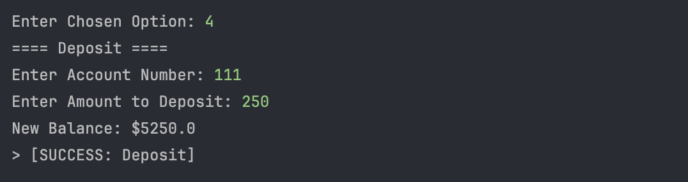
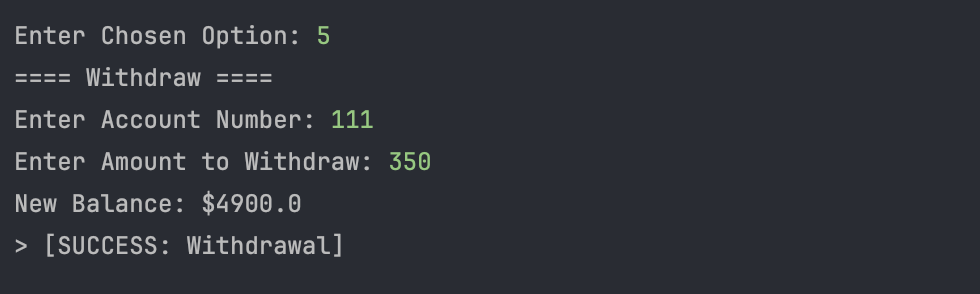

# Lab 1: Build a Java Bank Account System

Submitted by: Christopher Bayquen | July 3, 2025

This repository holds our submission for our Lab 1 Activity for the Second Session of our Java Fundamental Class. For this activity we were tasked to create a banking system where users can create accounts, view all accounts, view balances, deposit, and withdraw.

### Input/Output :

**Valid Input: Creating an Account**

**Valid Input: Viewing All Accounts**

**Valid Input: Checking Balances**

**Valid Input: Depositing**

**Valid Input: Withdrawing**

**Valid Input: Exiting**

