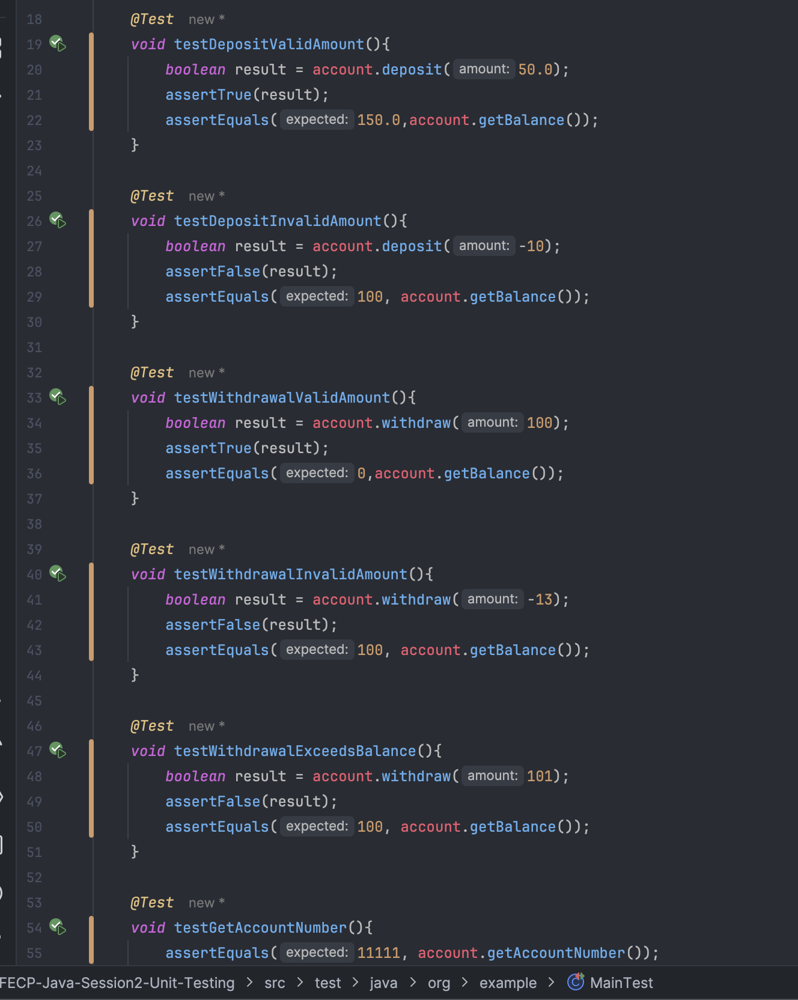
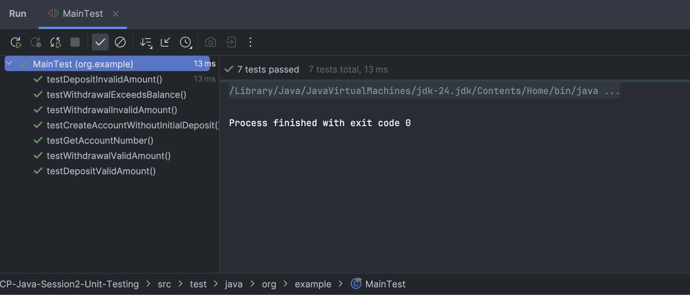
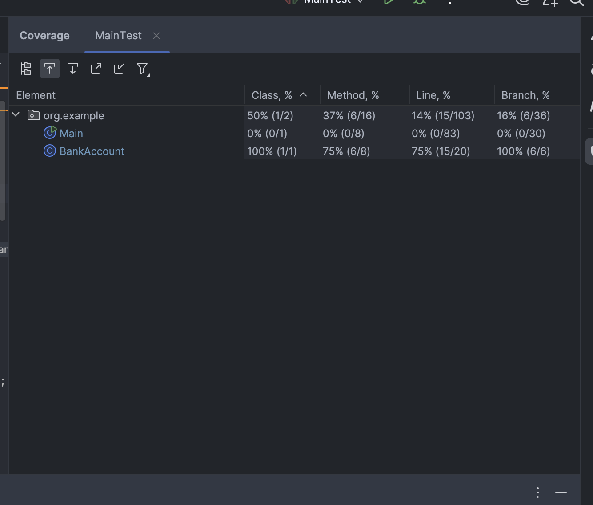

# Lab 2: Unit Testing

Submitted by: Christopher Bayquen | July 4,  2025

This repository holds my submission for our Lab 3 Activity which tasked us to create a banking system. For this lab activity we were to implement unit testing for the program created the previous lab. This repository holds the `MainTest.java`  which implements testing the following:

1. Deposit a valid amount
2. Deposit an invalid amount
3. Withdraw a valid amount
4. Withdraw an invalid amount
5. Withdraw an amount that exceeds the balance
6. Test the getAccountNumber() method
7. Test creation of Bank Account without deposits

### Unit Test :

### Test Coverage :

